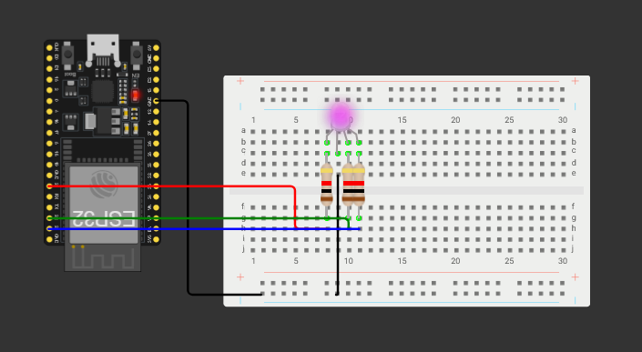

# Contextualização:

O objetivo da atividade é praticar a utilização da Programação Orientada a Objetos em C++, para a realização do projeto do Módulo 4 (IoT). Para isso, o simulador Wokwi foi utilizado. O projeto também pode ser encontrado [nesse link.](https://wokwi.com/projects/445523808957329409)

# Análise do Código:

O código completo está disponível [aqui](src/code.ino).

```C++
int red_RGB = 21;
int green_RGB = 22;
int blue_RGB = 23;


void setup() {
  Serial.begin(115200);
  Serial.println("Hello, ESP32!");
  pinMode(red_RGB, OUTPUT);
  pinMode(green_RGB, OUTPUT);
  pinMode(blue_RGB, OUTPUT);
}
```
A primeira etapa do código é a atribuição das portas utilizadas por cada perna do LED RGB em uma variável, para utilização futura. Depois, o _Setup_ é realizado, declarando que os pinos estão no modo _Output_.

```C++
class LED_RGB{
  public: 
    int red_light;
    int green_light;
    int blue_light;
    LED_RGB(int red, int green, int blue): red_light(red), green_light(green), blue_light(blue) {}

    void purpleColor(){
      digitalWrite(red_light, HIGH);
      digitalWrite(green_light, LOW);
      digitalWrite(blue_light, HIGH);
    }
    void cyanColor(){
      digitalWrite(red_light, LOW);
      digitalWrite(green_light, HIGH);
      digitalWrite(blue_light, HIGH);
    }
};
```

Depois, uma classe genérica para LEDs RGB é criada. Isso significa que, futuramente, será possível instanciar essa classe diversas vezes, permitindo que vários RGBs sejam utilizados sem que seja necessário a repetição do código. Essa classe necessita de três entradas, na qual cada unma corresponde a uma cor de LEED (Vermelho, Verde e Azul).

Depois, duas funções específicas da classe são criadas. Elas são: purpleColor e cyanColor, que definem a cor roxo e ciano para o RGB. Em cada uma dessas funções, é definido se cada cor do LED será ligada ou não, formando o resultado desejado.

```C++
void loop() {
  LED_RGB led(red_RGB, green_RGB, blue_RGB);
  led.purpleColor();
  delay(500); 
  led.cyanColor();
  delay(500);
}
```

Por fim, temos o _loop_, que é repetido sem parar. Primeiro uma instância da classe LED_RGB é criada, passando as portas (que foram definidas no ínicio do código) como parâmetros. Depois, a função da cor roxo é chamada, seguida de um delay. Depois, a função da cor ciano é chamada, também seguida por um delay. Essa escolha permite que o LED crie um efeito de transição entre cores, demonstrando a funcionalidade da Programação Orientada a Objetos.

# Print Demonstrativo:

<div style="text-align:center">
  <p style="margin-bottom:8px;"><strong>Imagem do sistema utilizado</strong></p>
  
</div>
